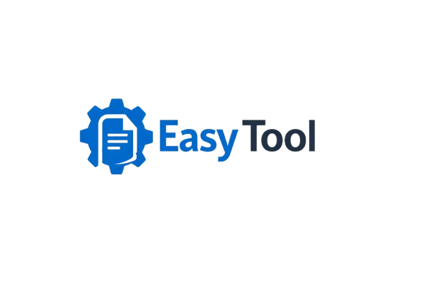

<div align="center">



# 🛠️ EasyTools

**All-in-One Utility Web Application** 

EasyTools adalah platform utilitas berbasis web yang menyediakan berbagai macam alat (tools) yang mudah digunakan untuk mempermudah pekerjaan sehari-hari Anda, mulai dari memanipulasi gambar, memproses dokumen PDF, hingga mengelola file media lainnya.

[](https://nextjs.org/)
[](https://react.dev/)
[](https://tailwindcss.com/)
[](https://fastapi.tiangolo.com/)
[](https://www.python.org/)
[](https://www.docker.com/)

</div>

---

## ✨ Fitur Utama

### 🖼️ Alat Gambar (Image Tools)
- **Image Resize:** Ubah ukuran gambar dengan cepat dengan menjaga rasio aspek.
- **Image Crop:** Potong bagian gambar yang tidak diinginkan secara presisi.
- **Image Watermark:** Tambahkan perlindungan hak cipta atau logo pada gambar Anda.
- **Background Removal:** Hapus latar belakang gambar secara instan dengan teknologi AI.

### 📄 Alat Dokumen (Document Tools)
- **PDF Rotate:** Putar orientasi halaman dokumen PDF dengan mudah.
- **Konversi Format:** Konversi PDF ke Word (DOCX) dan Word ke PDF secara cepat.

### 🎥 Alat Media (Media Tools)
- Pemrosesan video dan audio didukung oleh integrasi **FFmpeg**.

---

## 🚀 Teknologi yang Digunakan

Proyek ini dibangun menggunakan arsitektur modern yang memisahkan antara _frontend_ dan _backend_ untuk performa dan skalabilitas yang lebih baik.

- **Frontend:** Next.js 14, React 18, Tailwind CSS, Axios, React Dropzone.
- **Backend:** FastAPI, Python (Uvicorn), Pillow (Pemrosesan Gambar), PyPDF2 & pikepdf (Pemrosesan PDF), rembg (Penghapusan Latar Belakang), passlib & bcrypt (Keamanan).
- **Infrastruktur:** Docker & Docker Compose.

---

## ⚙️ Persyaratan Sistem

Sebelum menjalankan proyek ini secara lokal, pastikan Anda telah menginstal beberapa perangkat lunak berikut:

- **Node.js** (v18 atau lebih baru)
- **Python** (v3.10 - v3.12 disarankan)
- **FFmpeg** (Wajib ditambahkan ke PATH sistem operasi Anda untuk fungsi media)
- **Docker & Docker Compose** (Opsional, jika ingin menjalankan via container)

---

## 🛠️ Instalasi & Menjalankan Proyek Secara Lokal

### 1. Kloning Repositori

```bash
git clone https://github.com/elelcahyani/easytool.git
cd easytool
```

### 2. Konfigurasi Lingkungan (Environment Variables)

Buat file `.env` di dalam folder `backend/` berdasarkan file contoh (jika ada). 
> **Catatan:** Jangan bagikan file `.env` ke publik, file tersebut berisi pengaturan rahasia (seperti secret keys).

### 3. Menggunakan Docker (Rekomendasi)

Anda dapat menjalankan seluruh layanan menggunakan Docker dengan sangat mudah:

```bash
docker-compose up --build
```
Aplikasi frontend dapat diakses di `http://localhost:3000` dan backend di `http://localhost:8000`.

### 4. Menjalankan Secara Manual (Tanpa Docker)

**A. Backend (FastAPI)**
```bash
cd backend
python -m venv venv
# Aktifkan virtual environment
# Windows: venv\Scripts\activate
# Linux/Mac: source venv/bin/activate

pip install -r requirements.txt
uvicorn main:app --reload --port 8000
```
_(Backend akan berjalan di `http://localhost:8000`)_

**B. Frontend (Next.js)**
 Buka terminal baru dan jalankan:
```bash
cd frontend
npm install
npm run dev
```
_(Frontend akan berjalan di `http://localhost:3000`)_

---

## 🔒 Keamanan & Batasan

- **Keamanan Data:** Sistem kami mengimplementasikan limitasi pengunggahan file dan pemrosesan yang efisien untuk mencegah memori berlebih (`MAX_FILE_SIZE` telah dibatasi pada sistem).
- **Penghapusan File Otomatis:** File yang diunggah dan hasil pemrosesan sementara disimpan di folder `temp/` dan akan dikelola/dihapus agar tidak menumpuk.

---

## 👨‍💻 Kontribusi

Kontribusi selalu diterima! Jika Anda menemukan bug, memiliki ide untuk alat (tools) baru, atau ingin memperbaiki dokumentasi, silakan buat *Pull Request* atau buka *Issue*.

1. **Fork** repositori ini
2. Buat *branch* fitur Anda (`git checkout -b feature/NamaFitur`)
3. Lakukan *commit* pada perubahan Anda (`git commit -m 'Menambahkan fitur XYZ'`)
4. *Push* ke *branch* (`git push origin feature/NamaFitur`)
5. Buka *Pull Request*

---

<div align="center">
  Dibuat dengan ❤️ oleh <a href="https://github.com/elelcahyani">Elfa Dwi Cahyani</a>
</div>
